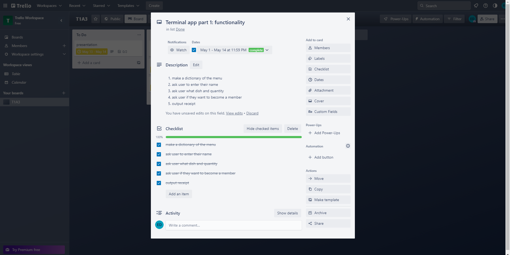
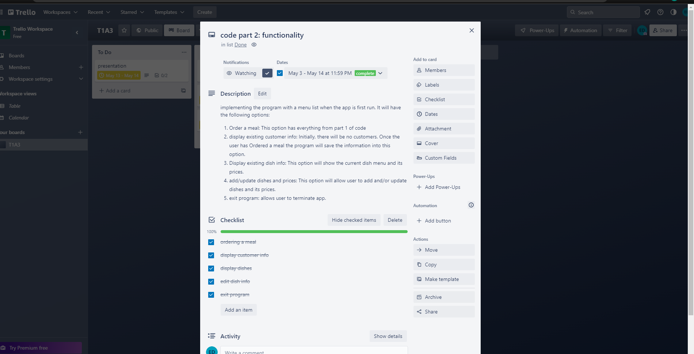
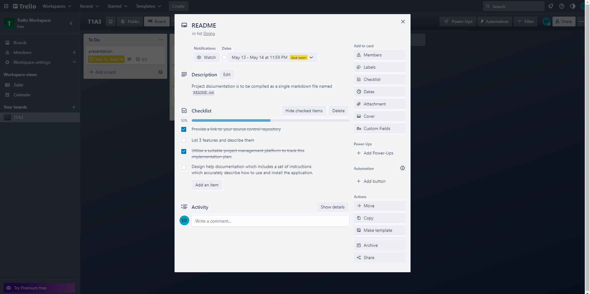
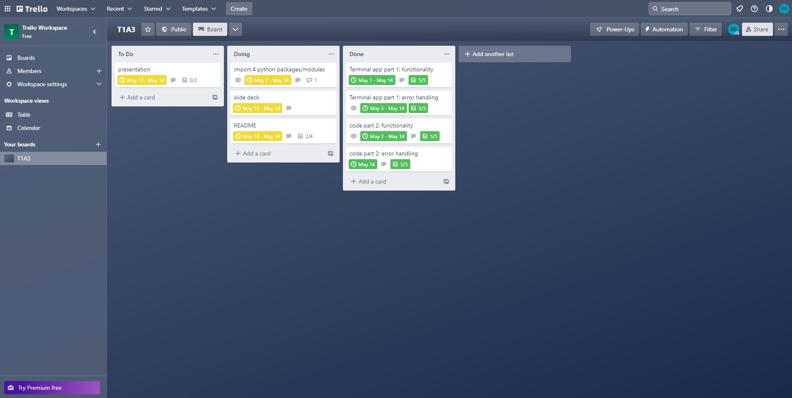

# Restaurant ordering app

## How to use app
1. This app requires Python.
2. when you  first run the app you will be presented with a menu with options 1-5. Input your desired option NUMBER into the console.
3. When you enter 1 on the option list you will be asked to enter your name then the desired dish name (initially you can pick from coke, burger, or pizza) then enter the quantity of desired dish (must be a positive integer). At the end you will be asked if customer is in a members program. simply enter y (yes) or n (no). non-members pay a service fee of 10% of total cost of order. members do not pay a service fee. After doing all these steps a receipt will be printed that summaries the order. App will bring you back to menu.
4. When you enter 2 on the option list it will print out the summary of customer details collected from option 1 of the menu. Running the app initially will not print any customer.
5. When you enter 3 on the option list it will print out the summary of current dishes and its prices.
6. When you enter 4 on the option list you will be asked to enter new dish name and its price. In this format- dish: price. For example, muffin: 5
This will add to the existing dish menu and customers can now add them to their order.
7. When you enter 5 the app will close.

## app features
### dictionaries and variables
The app features dictionaries, which is used for the name of the dishes and its prices, and lists, which is used for storing the name of customers.
### Loops and conditional control structures
Loops and conditional control structures are utilised heavily on this app due to the user having to loop through the menu and its options. Furthermore, the options from the menu list are directly influnced by other options.
### Error handling
Every option from the list and the list itself all have error handling for example when you enter a number less than 1 or more than 5 the app will tell the user it is invalid. another example is when you enter a new dish to add the food menu the format must be correct or the app will ask you to do it properly.

## Trello screenshots

## Links
[Loom presentation part 1](https://www.loom.com/share/60d49dc3ea5644f99912d2a22a75fe92)
[Loom presentation part 2](https://www.loom.com/share/7e0317e70c11491db9d01e9f45296a86)
[Trello](https://trello.com/invite/b/zq6Rm090/ATTIfdd06380313bd716259df1adb694910cD5F3BD63/t1a3)
[Github](https://github.com/3renD/T1A3)
